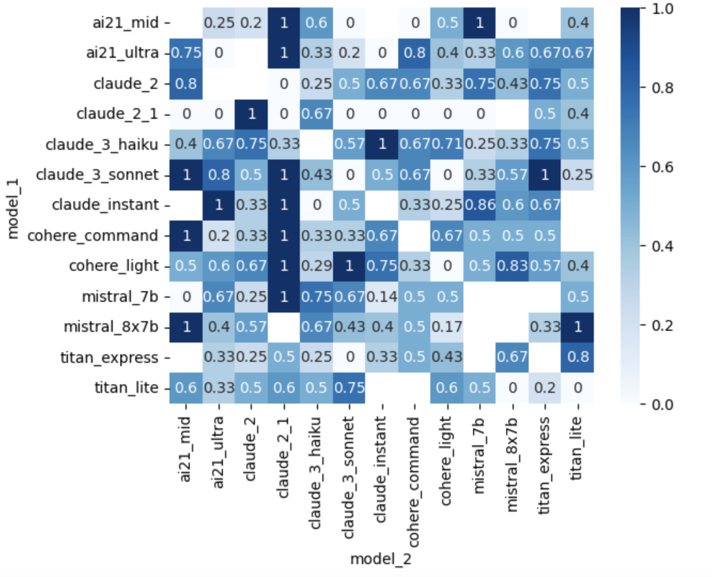

# Evaluate LLMs in real time with Street Fighter III

<div align="center">
    
</div>

Make LLM fight each other in real time in Street Fighter III.

Which LLM will be the best fighter ?

## Our criterias 🔥

They need to be:

- **Fast**: It is a real time game, fast decisions are key
- **Smart**: A good fighter thinks 50 moves ahead
- **Out of the box thinking**: Outsmart your opponent with unexpected moves
- **Adaptable**: Learn from your mistakes and adapt your strategy
- **Resilient**: Keep your RPS high for an entire game

## Let the fight begin 🥷

### 1 VS 1: Mistral 7B vs Mistral 7B

https://github.com/OpenGenerativeAI/llm-colosseum/assets/19614572/79b58e26-7902-4687-af5d-0e1e845ecaf8

### 1 VS 1 X 6 : Mistral 7B vs Mistral 7B

https://github.com/OpenGenerativeAI/llm-colosseum/assets/19614572/5d3d386b-150a-48a5-8f68-7e2954ec18db

## A new kind of benchmark ?

Street Fighter III assesses the ability of LLMs to understand their environment and take actions based on a specific context.
As opposed to RL models, which blindly take actions based on the reward function, LLMs are fully aware of the context and act accordingly.

# Results

Our experimentations (314 fights so far) led to the following leader board.
Each LLM has an ELO score based on its results

## Ranking

### ELO ranking

| Model                          |  Rating |
| ------------------------------ | ------: |
| 🥇claude_3_haiku               | 1613    |
| 🥈claude_3_sonnet              | 1557    |
| 🥉claude_2                     | 1554    |
| claude_instant                 |  1548   |
| cohere_light                   | 1527    |
| cohere_command                 | 1511    |
| titan_express                  | 1502    |
| mistral_7b                     | 1490    |


### Win rate matrix



# Explanation

Each player is controlled by an LLM.
We send to the LLM a text description of the screen. The LLM decide on the next moves its character will make. The next moves depends on its previous moves, the moves of its opponents, its power and health bars.

- Agent based
- Multithreading
- Real time

  

# Prerequisites

* Install [Docker](https://docs.docker.com/engine/install/)
* [Model Access in Amazon Bedrock](https://us-east-1.console.aws.amazon.com/bedrock/home?region=us-east-1#/modelaccess) fo us-east-1 and us-west-2. [Details here](https://docs.aws.amazon.com/bedrock/latest/userguide/model-access.html)

# Installation

- Follow instructions in https://docs.diambra.ai/#installation
- Download the ROM and put it in `~/.diambra/roms`
- Install with `pip3 install -r requirements`
- Create a `.env` file and fill it with the content like in the `.env.example` file
- Start Docker Diambra container
```bash
docker run -d -v $HOME/.diambra/credentials:/tmp/.diambra/credentials   -v /Users/$USER/.diambra/roms:/opt/diambraArena/roms -p 50051:50051 docker.io/diambra/engine:latest
```
- Run with `make run`

### Demo mode

- Run with `make demo`

### Endless mode

- Run with `make go`

## Test mode

To disable the LLM calls, set `DISABLE_LLM` to `True` in the `.env` file.
It will choose the action randomly.

## Logging

Change the logging level in the `script.py` file.

## How to make my own LLM model play? Can I improve the prompts?

The LLM is called in `Robot.call_llm()` method of the `agent/robot.py` file.

```python
    def call_llm(
        self,
        temperature: float = 0.7,
        max_tokens: int = 50,
        top_p: float = 1.0,
    ) -> str:
        """
        Make an API call to the language model.

        Edit this method to change the behavior of the robot!
        """

        # Generate the prompts
        move_list = "- " + "\n - ".join([move for move in META_INSTRUCTIONS])
        system_prompt = f"""You are the best and most aggressive Street Fighter III 3rd strike player in the world.
Your character is {self.character}. Your goal is to beat the other opponent. You respond with a bullet point list of moves.
{self.context_prompt()}
The moves you can use are:
{move_list}
----
Reply with a bullet point list of moves. The format should be: `- <name of the move>` separated by a new line.
Example if the opponent is close:
- Move closer
- Medium Punch

Example if the opponent is far:
- Fireball
- Move closer"""

        prompt = "Your next moves are:"

        start_time = time.time()

        logger.debug(f"LLM call to {self.model}: {system_prompt}")
        logger.debug(f"LLM call to {self.model}: {time.time() - start_time}s")

        print(system_prompt + "\n" + prompt)
        if self.player_nb == 1:
            bedrock_runtime = bedrock_runtime_east
        else:
            bedrock_runtime = bedrock_runtime_west

        llm_response = call_bedrock_model(self.model, system_prompt, prompt, bedrock_runtime)
        print(f"{self.model} making move {llm_response}")
        return llm_response
```

To use another model or other prompts, make a call to another client in this function, change the system prompt, or make any fancy stuff.

### Submit your model

Create a new class herited from `Robot` that has the changes you want to make and open a PR.

We'll do our best to add it to the ranking!

# Credits

Made with ❤️ by the OpenGenerativeAI team from [phospho](https://phospho.ai) (@oulianov @Pierre-LouisBJT @Platinn) and [Quivr](https://www.quivr.app) (@StanGirard) during Mistral Hackathon 2024 in San Francisco
